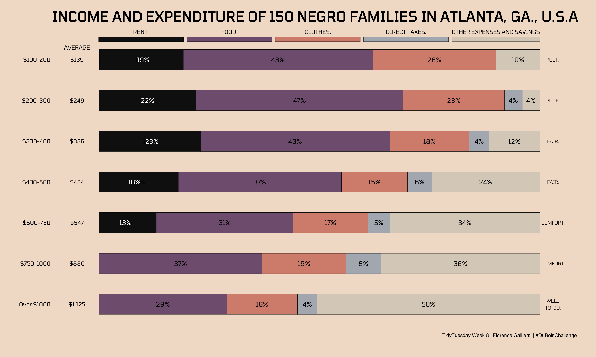
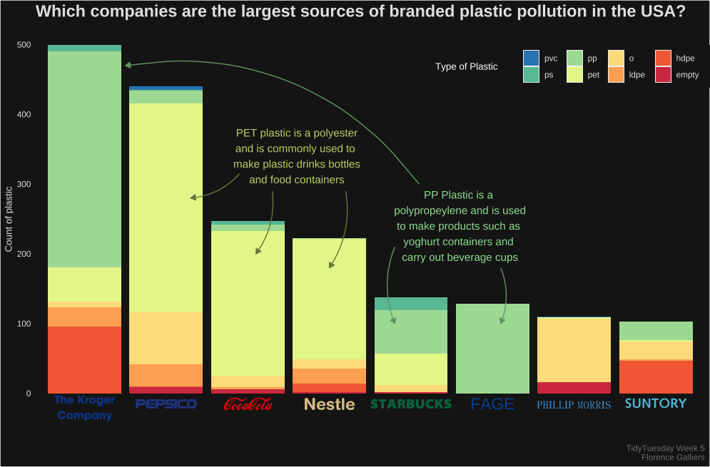
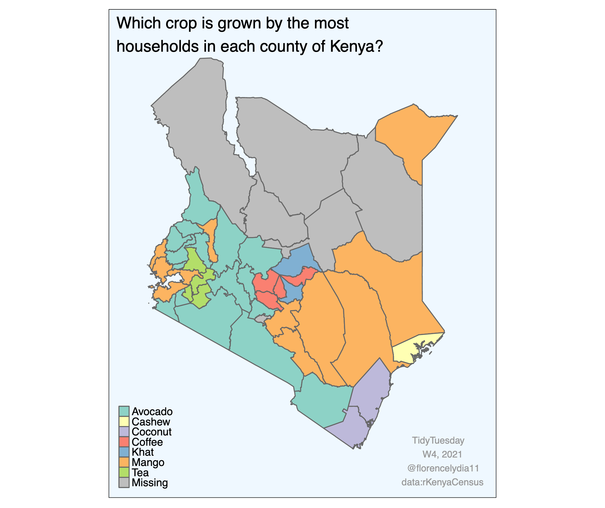

# TidyTuesday 2021

This repository contains my contributions to TidyTuesday Data Visualisations 2021

- [Week 8](./8-duboischallenge): DuBois Challenge, recreated data visualisations with modern techniques in celebration of W.E.B. DuBois. I completed Challenge 05: Income and Expenditure of 150 Negro Families in Atlanta, GA, USA

- [Week 5](./5-plastics): Break Free from Plastic, creation of plot showing which companies are the largest sources of branded plastic pollution in the USA in 2020. Exploring the use of different fonts and annotations. 

- [Week 4](./4-Kenya): rKenyaCensus, creation of plot mapping the crop that is grown by the most people in each county of Kenya. Packages used: {tmap}.

